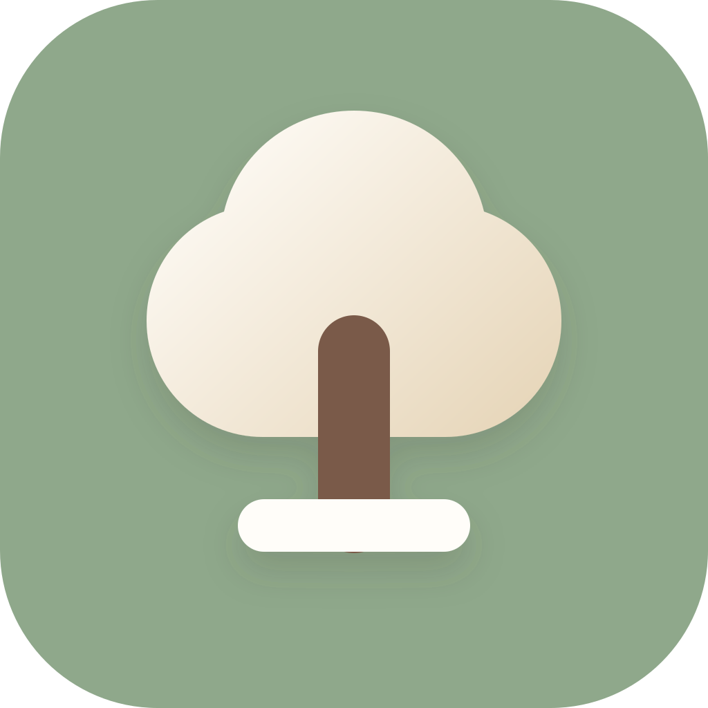

<p align="center">
  
</p>

<h1 align="center">Mood Tracker</h1>

<p align="center">
  本地存储、离线可用的心情与日常状态记录应用。
</p>

<p align="center">
  <a href="https://mood-tracker.jianghong.site/"></a>
  <a href="https://github.com/leon-claw/mood-tracker/releases"></a>
  
  
  
</p>

## 它是什么

**Mood Tracker** 是一个用于记录心情、睡眠、精力、活动、天气、社交和随笔的轻量健康日志。应用不需要账号，所有业务数据都保存在当前设备。

当前支持：

- Web 应用
- Android APK
- 本地离线存储
- JSON 导入导出
- 每日打卡提醒
- Android 版本更新提示

核心页面：

- 日志：搜索、筛选、编辑和删除历史记录
- 趋势：查看心情流、心情分布、睡眠质量与心情关系、年度概览
- 日历：按月回看记录，点击日期直接编辑
- 我的：本地存储、数据导入导出、字段显示、提醒和更新

记录字段分为三类：

- 量表：睡眠质量、心情、精力、饮食健康、工作效率
- 枚举：日常活动、天气、社交、达成成就
- 文本：随笔日志、成就

## 快速开始

你可以直接在线使用：

- 官网首页：<https://mood-tracker.jianghong.site/>
- Web 应用：<https://mood-tracker.jianghong.site/app/>
- Android 下载：<https://github.com/leon-claw/mood-tracker/releases>

应用打开后即可使用。记录、偏好、提醒设置和 Android 自动采集数据均保存在当前设备；建议定期从“我的”导出 JSON 备份。

## 如何开发

准备环境：

- Node.js 20 或更新版本
- pnpm

安装依赖：

```bash
pnpm install
```

启动前端：

```bash
npm run dev
```

默认访问地址：

```text
http://localhost:3000/
```

常用验证命令：

```bash
npm run lint
npm run build
```

官网首页位于 `site/`，与主应用分开构建：

```bash
npm run site:dev
npm run site:build
```

## 部署

推荐线上路径：

- `/`：官网首页，来自 `site` 构建产物
- `/app/`：主应用，来自根目录主应用构建产物

构建主应用：

```bash
npm run build
```

部署到 `/app/` 子路径：

```bash
npm run build:prod
```

主应用构建产物不依赖后端服务，部署静态文件即可。

## Android

Android 端使用 Capacitor 包装同一套 Web 应用，数据继续保存在设备本地。

准备环境：

- Android SDK
- JDK 21

同步 Web 资源到 Android 项目：

```bash
npm run android:sync
```

构建 debug APK：

```bash
npm run android:apk:debug
```

生成文件位于：

```text
android/app/build/outputs/apk/debug/app-debug.apk
```

可选 Android 构建变量：

```bash
VITE_ANDROID_APP_VERSION=1.0.3
VITE_ANDROID_UPDATE_URL=https://example.com/latest.json
```

构建 release APK：

```bash
npm run android:apk:release
```

### Android 自动设备数据

在“记录模块设置”中开启“全天步数”“今日天气”“屏幕活跃时长”后，应用才会配置后台采集；关闭模块会停止后续采集，但不会删除已有记录。

- 全天步数：后台按约 60 分钟周期读取设备步数传感器，使用 Android 的活动识别权限。
- 屏幕活跃时长：Android 8.0（API 28）及以上统计屏幕交互时长；Android 7.0–7.1（API 24–27）回退统计应用前台时间，后台约按 60 分钟周期更新，需要使用情况访问权限。
- 今日天气：每天按设备本地日期最多采集一次；临时读取位置后调用 Open-Meteo，不保存或显示经纬度。需要位置权限和系统定位服务。
- 采集结果先写入 Android 原生队列，应用启动或回到前台时合并到本地记录。

步数当前使用 Android 系统步数传感器作为兼容 Android 7.0（API 24）及以上设备的实现；传感器不可用时不会伪造步数。

## 项目结构

```text
src/                  主应用源码
src/components/       页面、弹窗、图表和设置组件
shared/               偏好设置模型
site/                 官网首页
android/              Capacitor Android 项目
public/               图标、字体和静态资源
```

## 数据格式

导出的 JSON 使用应用级 envelope，方便后续扩展：

```json
{
  "app": "mood-tracker",
  "version": 1,
  "exportedAt": "2026-07-08T00:00:00.000Z",
  "data": {
    "entries": [],
    "points": 0,
    "unlockedItems": [],
    "isPremiumUnlocked": false,
    "preferences": {
      "enabledRecordFieldIds": [],
      "reminders": {
        "enabled": false,
        "times": ["21:00"]
      }
    }
  }
}
```

导入时会校验并规范化字段，非法日期、未知枚举和越界量表值不会直接污染应用数据。

## License

暂未添加 License 文件。
